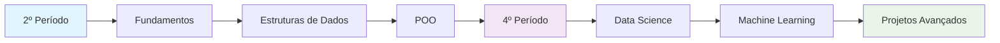

# 🐍 Atividades de Python - UNIFATEC

---

## 📋 Sobre o Repositório

Este repositório contém **todas as atividades e projetos de Python** desenvolvidos durante o curso de **Engenharia de Computação na UNIFATEC**. As atividades estão organizadas por período acadêmico, facilitando o acompanhamento da evolução do aprendizado e consulta rápida.

### 🎯 **Objetivos:**
- 📚 Documentar o progresso no aprendizado de Python
- 🔗 Centralizar todas as atividades em um local acessível
- 💡 Servir como referência para estudos futuros
- 🚀 Demonstrar evolução técnica ao longo do curso

---

## 📊 Status do Repositório

| Período | Listas Completas | Exercícios | Projetos | Status |
|---------|------------------|------------|----------|--------|
| **2º Período** | 3 | 21 | 0 | ✅ Concluído |
| **4º Período** | 0 | 7 | 1 | 🔄 Em Andamento |
| **Total** | **3** | **28** | **1** | **📈 Ativo** |

---

## 🎓 2º Período

<h3>📝 Lista 1 - Fundamentos Básicos</h3>

| # | Exercício | Link |
|---|-----------|------|
| 1 | **Introdução ao Python** |  |
| 2 | **Variáveis e Tipos** |  |
| 3 | **Operadores** |  |
| 4 | **Estruturas Condicionais** |  |
| 5 | **Loops e Iterações** |  |
| 6 | **Funções Básicas** |  |

<h3>📝 Lista 2 - Estruturas de Dados</h3>

| # | Exercício | Link |
|---|-----------|------|
| 1 | **Listas** |  |
| 2 | **Tuplas** |  |
| 3 | **Dicionários** |  |
| 4 | **Sets/Conjuntos** |  |
| 5 | **Manipulação de Strings** |  |
| 6 | **Funções Avançadas** |  |
| 7 | **Tratamento de Exceções** |  |
| 8 | **Arquivos e I/O** |  |
| 9 | **Módulos e Pacotes** |  |

<h3>📝 Lista 3 - Programação Orientada a Objetos</h3>

| # | Exercício | Link |
|---|-----------|------|
| 1 | **Classes e Objetos** |  |
| 2 | **Herança** |  |
| 3 | **Polimorfismo** |  |
| 4 | **Encapsulamento** |  |
| 5 | **Métodos Especiais** |  |
| 6 | **Abstração** |  |

---

## 🎓 4º Período

<h3>📚 Atividades Avançadas</h3>

| # | Tópico | Conteúdo | Link |
|---|--------|----------|------|
| 1 | **Data Science Básico** | Introdução ao Pandas e NumPy |  |
| 2 | **Visualização de Dados** | Matplotlib e Seaborn |  |
| 3 | **Análise Estatística** | Estatística com Python |  |
| 4 | **Machine Learning** | Scikit-learn Básico |  |
| 5 | **Web Scraping** | BeautifulSoup e Requests |  |
| 6 | **APIs e JSON** | Trabalhando com APIs |  |
| 8 | **Streamlit Avançado** | Dashboards Interativos |  |

---

## 🚀 Projetos em Destaque

### 🎬 **Dashboard IMDB - Análise de Filmes**

**🎯 Projeto Principal do 4º Período**

Dashboard interativo desenvolvido com **Streamlit** para análise de dados do IMDB, incluindo:

- 📊 **Visualizações Interativas** de ratings e gêneros
- 🔍 **Filtros Dinâmicos** por ano, diretor e ator
- 📈 **Análises Estatísticas** de tendências do cinema
- 🎨 **Interface Moderna** e responsiva

**Tecnologias:** Python, Streamlit, Pandas, Plotly, Seaborn

---

## 🛠️ Tecnologias Utilizadas

### **🐍 Core Python**

### **📊 Data Science**

### **🤖 Machine Learning**

### **🌐 Web & Dashboards**

---

## 📈 Progresso de Aprendizado

### 🎯 **Próximos Objetivos:**
- 🧠 **Deep Learning** com TensorFlow/PyTorch
- 🌐 **APIs REST** com FastAPI/Flask  
- 📱 **Aplicações Mobile** com Kivy
- ☁️ **Deploy na Nuvem** (AWS/Google Cloud)

---

## 📚 Como Usar Este Repositório

### 📖 **Para Estudantes:**
1. 📂 Navegue pelas pastas organizadas por período
2. 📝 Acesse os notebooks direto no Google Colab
3. 💾 Faça download dos PDFs das listas de exercícios
4. 🚀 Execute e modifique os códigos para praticar

### 👨‍🏫 **Para Professores:**
- 📋 Referência de exercícios progressivos
- 💡 Exemplos práticos de cada conceito
- 📊 Acompanhamento de evolução dos alunos

---

## 📞 Contato & Colaboração

---

### 💡 "A programação não é sobre o que você sabe; é sobre o que você pode descobrir." - Chris Pine

**⭐ Se este repositório te ajudou, considere dar uma estrela!**

*Última atualização: Julho 2025* | *Mantido com ❤️ por Wesley Prestes*

